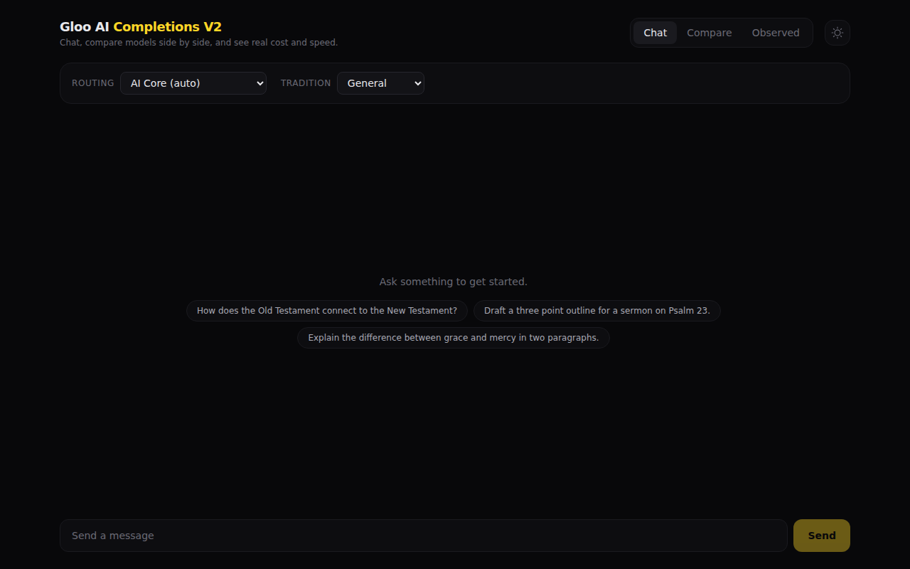
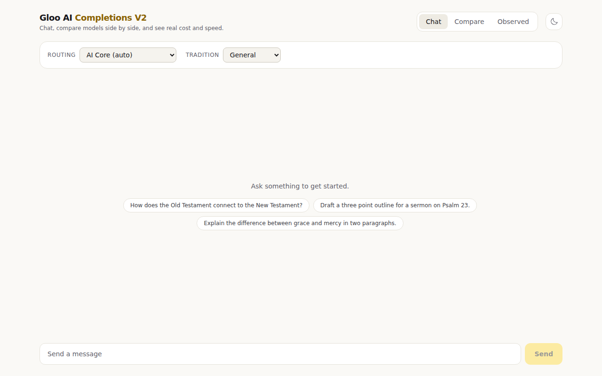

<a href="https://docs.gloo.com/?utm_source=github&utm_campaign=glooai-typescript-example">
  
</a>

# Gloo AI TypeScript Examples

TypeScript examples for the [Gloo AI](https://www.ai.gloo.com/) platform API:

| Package                | Description                                                           |
| ---------------------- | --------------------------------------------------------------------- |
| [`chatbot/`](chatbot/) | Next.js streaming chatbot using the Completions V2 API                |
| [`demo/`](demo/)       | Hosted demo: React SPA, proxy API on Fargate, DynamoDB, and Terraform |
| [`scripts/`](scripts/) | CLI scripts for auth, chat, ingestion, search, and item management    |

## Prerequisites

- **Node.js LTS** (`.nvmrc` provided — run `nvm use` or `fnm use`)
- **pnpm** (`corepack enable pnpm` if needed)
- **Gloo AI API key**, get one at https://studio.ai.gloo.com/api-keys

## Setup

```bash
# 1. Install dependencies
pnpm install

# 2. Configure credentials for the CLI scripts
cp scripts/.env.example scripts/.env.local
# Edit scripts/.env.local with your GLOO_AI_API_KEY

# 3. Configure credentials for the chatbot
cp chatbot/.env.local.example chatbot/.env.local
# Edit chatbot/.env.local with your GLOO_AI_API_KEY
```

## Chatbot

A Next.js app demonstrating streaming markdown rendering with the Gloo Completions V2 API. Uses Vercel AI SDK v6 with a custom OpenAI-compatible provider, react-markdown for streaming token rendering, and Tailwind CSS v4.

Supports all three Gloo routing modes (AI Core, AI Core Select, AI Select) plus tradition-aware responses.

```bash
# Development server at http://localhost:3000
pnpm dev

# Production build
pnpm --filter gloo-chatbot build
```

### Deploy to Vercel

Set **Root Directory** to `chatbot` and add the environment variable `GLOO_AI_API_KEY`.

## Demo

**Live at [glooai.servant.run](https://glooai.servant.run)** (Basic Auth:
`gloo` / `ai`, not a secret, just keeps the demo out of search indexes).

<p>
  
  
</p>

Chat with streaming responses, compare models side by side, and see real cost
and speed measured from actual traffic, not list-price estimates. Details on
the architecture, DynamoDB schema, and deploy runbook are in
[`demo/README.md`](demo/README.md).

```bash
pnpm demo:dev        # Vite dev server (needs DEMO_API_URL, see demo/README.md)
pnpm demo:deploy     # Build and push the API container, sync the SPA to S3
```

## CLI Scripts

Standalone scripts for exploring the Gloo AI platform APIs.

```bash
pnpm glooai:chat            # Chat completion (Completions V1)
pnpm glooai:ingest          # Content ingestion
pnpm glooai:items           # List items
pnpm glooai:items:metadata  # Item metadata
pnpm glooai:search          # Semantic search
pnpm glooai:jwt             # Inspect the configured API key
pnpm glooai:sonnet-4-repro  # Side-by-side: V1 Sonnet 4 vs. V2 Sonnet 4.5 / Haiku 4.5
pnpm glooai:whats-new       # Validate the 2026-05-26 release notes (models, cache, errors)
```

### What's New — 2026-05-26 release validators

`scripts/src/whats-new-2026-05-26.ts` programmatically validates the subset of
the [Week of May 26, 2026 changelog](https://docs.gloo.com/) that can be checked
automatically from a single API key. Three checks, each backed by a pure,
unit-tested classifier:

| #   | Release-note claim                                        | How it's validated                                                                                                                                                                                             |
| --- | --------------------------------------------------------- | -------------------------------------------------------------------------------------------------------------------------------------------------------------------------------------------------------------- |
| 1   | **11 new models + Gemini 3.1 Flash Lite → GA**            | Asserts each model is present in the authoritative `/platform/v2/models` registry **by display name** (not by guessing alias IDs); the GA check additionally asserts the entry is no longer flagged `preview`. |
| 2   | **`cache_tokens` / `cache_hit_rate` usage metrics**       | Sends a completion and validates both new usage fields are present and well-formed (non-negative tokens; hit-rate in `[0, 1]`).                                                                                |
| 3   | **Provider validation → actionable 4xx, not generic 500** | Sends a deliberately invalid model and classifies the response (`ACTIONABLE_CLIENT_ERROR` vs the old `GENERIC_SERVER_ERROR`).                                                                                  |

```bash
pnpm glooai:whats-new
```

A model reported `ABSENT` is surfaced, not silently dropped — it may indicate a
not-yet-entitled / region-routing gap for this client rather than an unlaunched
model (confirm in the [Studio Model Explorer](https://studio.ai.gloo.com/models)).
Claims that are **not** cheaply auto-validatable from here (Studio billing/usage
UI, streaming reliability, guardrail tuning, GlooCode, Data Engine org caps, docs
restructuring) are intentionally out of scope.

### Sonnet 4 V1→V2 reduced repro

`scripts/src/sonnet-4-repro.ts` is a side-by-side repro that compares the
legacy **V1 Messages** endpoint using the deprecated Anthropic Bedrock
inference profile `us.anthropic.claude-sonnet-4-20250514-v1:0` against
**V2 Completions** using the currently-supported Gloo aliases. It is
intended as a reduced test case for validating model routing and lifecycle
behavior after Anthropic's 2026-04-14 Sonnet 4 deprecation announcement.

Observed failure signatures on V1 with the deprecated model ID include
both HTTP 5xx with `{"detail":"Error generating response."}` and HTTP 200
with an empty `choices[0].message.content`. The verdict classifier handles
both — the exact signature varies by tenant/region routing.

The script runs three calls back-to-back against the same JWT so you can
diff them:

| #   | Endpoint                  | Model                                        | Purpose                                            |
| --- | ------------------------- | -------------------------------------------- | -------------------------------------------------- |
| 1   | `/ai/v1/chat/completions` | `us.anthropic.claude-sonnet-4-20250514-v1:0` | Deprecated Sonnet 4 under test (expected FAIL)     |
| 2   | `/ai/v2/chat/completions` | `gloo-anthropic-claude-sonnet-4.5`           | Supported Sonnet 4.5 alias on V2                   |
| 3   | `/ai/v2/chat/completions` | `gloo-anthropic-claude-haiku-4.5`            | Supported Haiku 4.5 alias — faster/cheaper drop-in |

**Anthropic lifecycle context** (publicly announced 2026-04-14):

- `claude-sonnet-4-20250514` is marked **Deprecated** with a retirement date of
  **2026-06-15**.
- API users may see **degraded availability starting 2026-05-14**.
- `claude-sonnet-4-5-20250929` and `claude-haiku-4-5-20251001` remain **Active**
  with no retirement sooner than 2026-09-29 / 2026-10-15 respectively.

Any workload still pinned to the retiring Sonnet 4 model ID should plan an
upgrade path before 2026-05-14.

## Development

The repo uses [Turborepo](https://turbo.build/) for task orchestration. Root scripts delegate to workspaces:

```bash
pnpm build           # Build all packages
pnpm lint            # Lint all packages
pnpm typecheck       # Type-check all packages
pnpm test            # Run all tests
pnpm test:coverage   # Vitest coverage (scripts only, 70% minimum)
pnpm format          # Prettier — format all files
pnpm format:check    # Prettier — check formatting
```

## Project Structure

```
├── chatbot/                 # Next.js streaming chatbot
│   ├── app/                 # App Router pages + API route
│   ├── components/          # Chat UI, message renderer, settings
│   └── lib/                 # Gloo auth + provider wrappers
├── demo/                    # Hosted demo (glooai.servant.run)
│   ├── api/                 # Proxy API (Fargate, DynamoDB ledger)
│   ├── docs/                # README screenshots
│   ├── terraform/           # S3 + CloudFront + ALB + Fargate + DynamoDB
│   └── web/                 # Static React SPA (Vite)
├── scripts/                 # CLI scripts + tests
│   ├── src/                 # Auth, chat, ingestion, search, items
│   └── tests/               # Vitest unit tests
├── turbo.json               # Turborepo task config
└── pnpm-workspace.yaml      # Workspace packages
```
